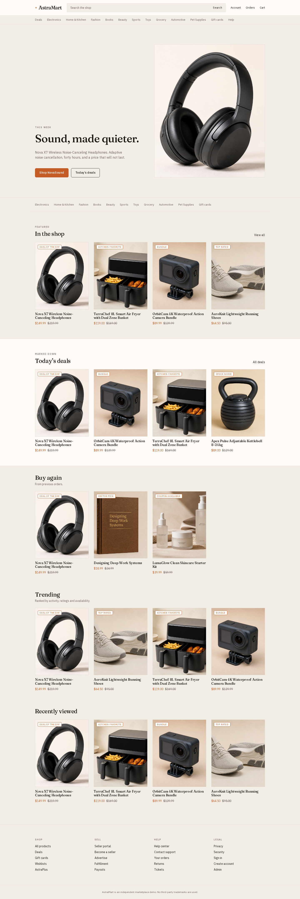
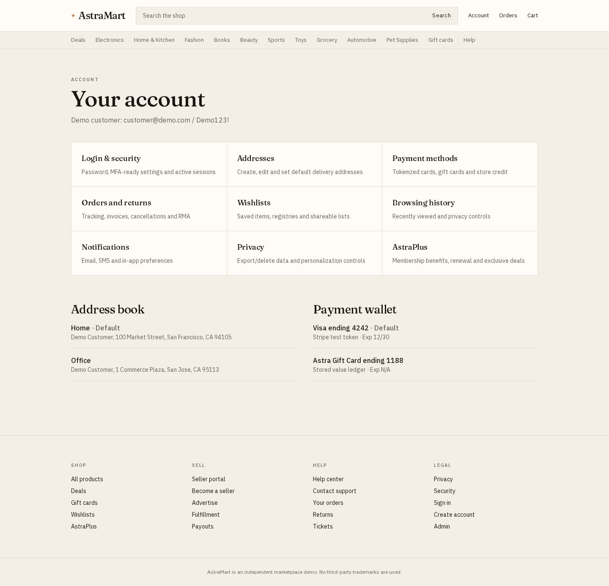
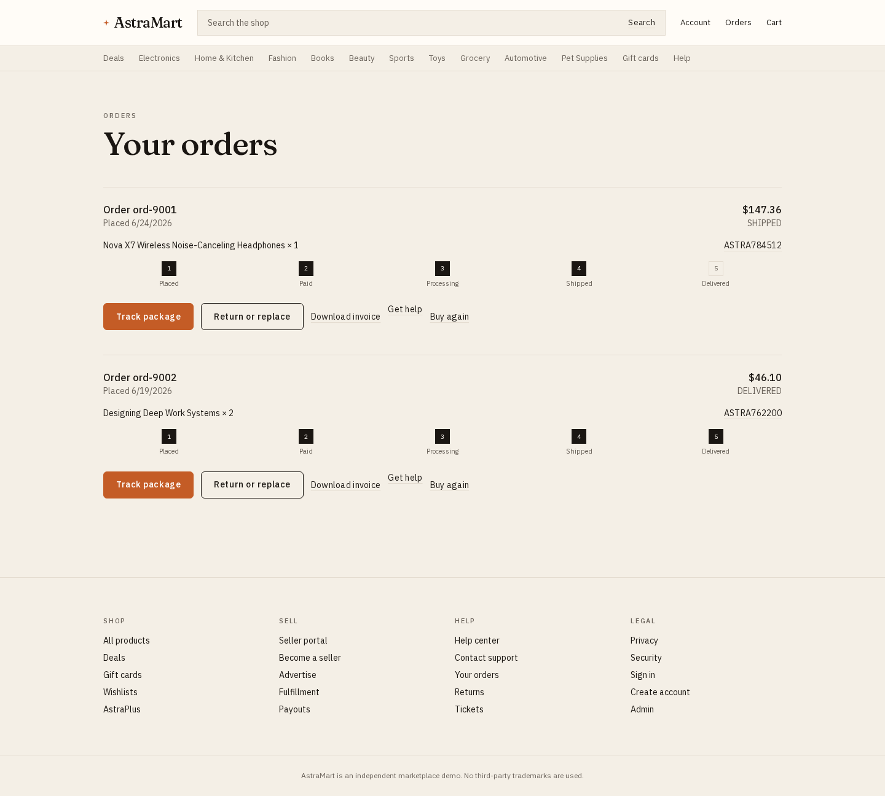
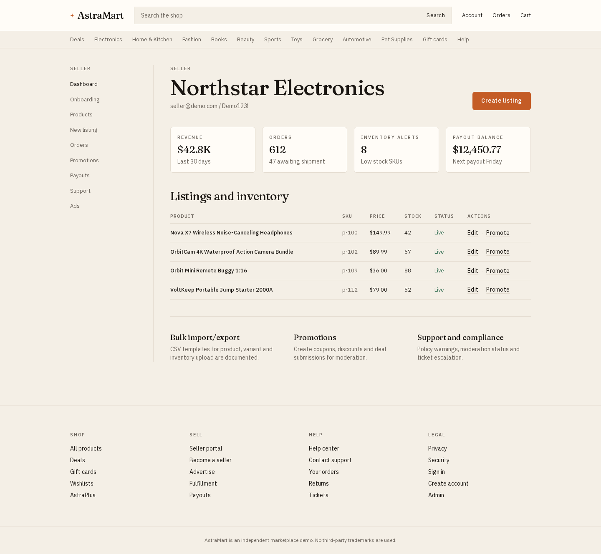
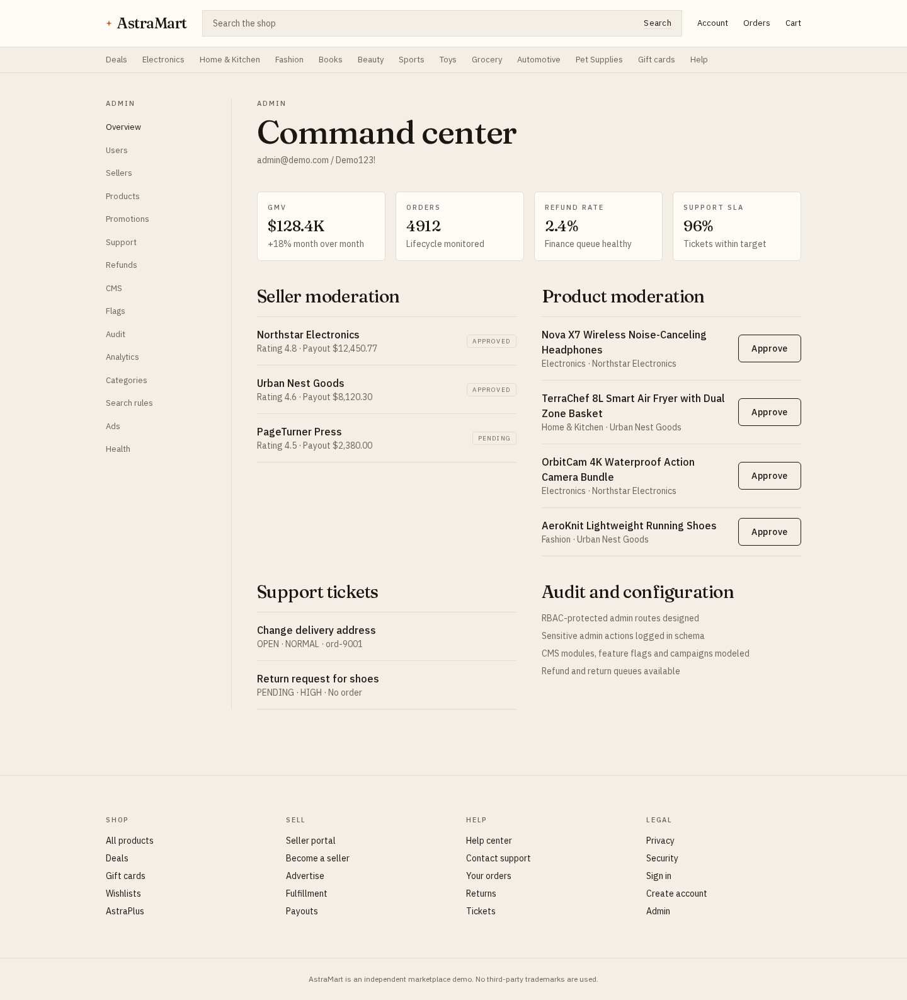

# AstraMart

Independent paper-and-copper marketplace demo with a customer storefront, seller portal, admin back-office, HMAC demo sessions, cart/checkout, returns, recommendations, and a Prisma schema for local production mode. Built as a portfolio demo.

[](https://astra-marketplace.vercel.app/)
[](https://github.com/devtechedge/astra-marketplace/actions/workflows/ci.yml)
[](https://nextjs.org/)
[](https://www.typescriptlang.org/)
[](https://www.prisma.io/)
[](https://tailwindcss.com/)
[](LICENSE)

## Live Demo

**https://astra-marketplace.vercel.app/**

> **Demo-mode status:** The live Vercel site uses seeded in-memory demo data and mock payments — not Prisma. Catalog browse, search, product photos, health, and coupon GET are public. **Checkout, account, orders, seller, and admin require sign-in.** Full Prisma/PostgreSQL schema + Docker Compose remain the local production foundation. No real payment capture, carrier labels, or object storage.

### Demo credentials

| Role     | Email              | Password  |
|----------|--------------------|-----------|
| Customer | `customer@demo.com` | `Demo123!` |
| Seller   | `seller@demo.com`   | `Demo123!` |
| Admin    | `admin@demo.com`    | `Demo123!` |

Shown on `/login` and this README on purpose for portfolio DX. Passwords are bcrypt-hashed in a server-only module (`src/lib/server/demoUsers.ts`) and are never shipped in the client bundle.

## Screenshots

| Storefront | Account |
|------------|---------|
|  |  |

| Orders | Seller dashboard |
|--------|------------------|
|  |  |

| Admin operations |
|------------------|
|  |

## Features

- **Design system** — paper `#F4EFE6` / surface `#FFFCF7` / ink `#1A1612` / copper `#C45C26` tokens; Fraunces (display) + IBM Plex Sans via `next/font`; Fraunces wordmark with a 4-point copper star; Account menu holds Seller/Admin; overlay scrollbars hidden until overflow + hover/focus
- **Customer storefront** — merchandising hero (not a GMV/SLA pitch), search, deals, product detail, cart, 6-step checkout (login required), orders, tracking, returns, wishlist, gift-card SKUs, AstraPlus membership
- **18-SKU catalog** — real JPEGs in `public/products` (not SVG placeholders) across Electronics, Home & Kitchen, Fashion, Books, Beauty, Sports, Toys, Grocery, Automotive, Pet Supplies, and Gift cards. Header lists Gift cards once via `/gift-cards`
- **Seller portal** — KPI dashboard, listings/inventory, product listing wizard, promotions, payouts, ads, support (signed session)
- **Admin command center** — GMV/orders/refund/SLA metrics, seller & product moderation, support tickets, audit, CMS, feature flags, analytics, search merchandising (signed session)
- **Commerce core** — coupons, tax/shipping calculation, mock payment intents, RMA-style returns, recommendation rows (buy again / trending / recently viewed)
- **Platform services** — HMAC session middleware, API RBAC, origin checks, auth rate limits, webhook secret, CSP without `unsafe-eval`, health API, notifications, review/Q&A endpoints
- **Production foundation** — Prisma schema, Docker Compose, GitHub Actions (unit + typecheck + Playwright), Dependabot, [SECURITY.md](SECURITY.md)

Playwright testids kept: `site-header`, `home-hero`, `add-to-cart`, `shopping-cart`, `login-page`, `seller-dashboard`, `admin-command-center`.

## Tech Stack

| Layer        | Technology |
|--------------|------------|
| Frontend     | Next.js 14 (App Router), TypeScript, Tailwind CSS, Fraunces + IBM Plex Sans via next/font, Lucide |
| Backend      | Next.js API routes, Zod validation |
| Data         | Prisma 5 + PostgreSQL schema (local foundation); seeded demo repository on Vercel |
| Auth         | HMAC cookie sessions + bcrypt demo users (server-only) |
| Tooling      | Vitest, Playwright, ESLint, GitHub Actions |
| Deploy       | Vercel — https://astra-marketplace.vercel.app/ |


## Quick Start

```bash
npm install
npm run dev
```

Open http://localhost:3000

```bash
npm test            # unit — 26 passed (commerce, rbac, validation, session, origin)
npm run typecheck
npm run test:e2e    # Playwright Chromium smokes (signed session cookies)
```

Optional local database (not used by the Vercel demo):

```bash
cp .env.example .env
docker compose up -d
npm run db:generate && npm run db:push && npm run db:seed
```

Set `APP_SECRET` before treating sessions as real. The code has a demo HMAC fallback if it is unset.

## Architecture notes

- Service/repository split for auth, catalog, cart, checkout, fulfillment, returns, seller and admin
- HMAC-SHA256 `astra-session` cookie (httpOnly, SameSite=lax, Secure on Vercel/production, 8h). Missing/invalid session is **GUEST**, never CUSTOMER. `astra-role` is ignored and cleared.
- API RBAC via `requireSession` in `src/lib/security/api.ts`; origin check on mutating `/api` except the payment webhook; auth rate limit 10/10min/IP in memory
- Middleware gates `/admin*`, `/seller*`, `/checkout*`, `/account*`, `/orders*`
- Demo repository powers the live Vercel deploy; swap to Prisma client for real persistence. **Prisma is not live on Vercel.**
- Threat model: [SECURITY.md](SECURITY.md). Deeper docs under `docs/` (ARCHITECTURE, API_SPEC, DEPLOYMENT)

## License

MIT License. See [LICENSE](LICENSE) for details.
